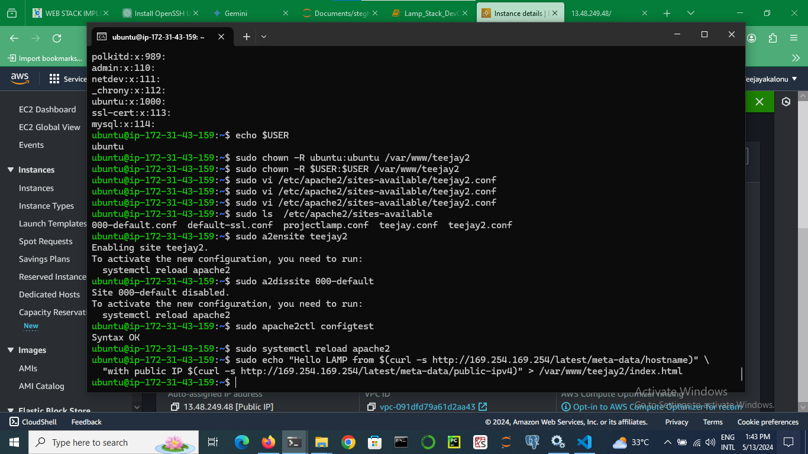

### LAMP STACK

### WEB STACK IMPLEMENTATION (LAMP STACK) IN AWS

#### First we launch our ubuntu terminal on windows, create an EC2 instance in aws and ssh into our instance with *sudo service ssh start* in our ubuntu terminal

Now, to SSH into your instance:

1)Open your terminal (Ubuntu) or use an SSH client. 

2)Navigate to the directory where your private key (.pem) file is located.
  cd /mnt/c/Users/pc/Desktop

3)Use the following command to SSH into your instance:
  ssh -i xxxxxx.pem ubuntu@(my instance public-ip)
  

### Our First issue
i experienced my first issue while trying to change permission of my .pem file so i can ssh into my aws instance:

#### 1)sudo chmod 0400 second_try.pem
      
      chmod: changing permissions of 'second_try.pem': Permission denied

(solution) changed the entire permissions from the files security settings in windows (through the files properties).

#### 2)ssh -i "second_try.pem" ubuntu@xxxxxxxxxx.eu-north-1.compute.amazonaws.com
@@@@@@@@@@@@@@@@@@@@@@@@@@@@@@@@@@@@@@@@@@@@@@@@@@@@@@@@@@@
@         WARNING: UNPROTECTED PRIVATE KEY FILE!          @
@@@@@@@@@@@@@@@@@@@@@@@@@@@@@@@@@@@@@@@@@@@@@@@@@@@@@@@@@@@
Permissions 0555 for 'second_try.pem' are too open.
It is required that your private key files are NOT accessible by others.
This private key will be ignored.
Load key "second_try.pem": bad permissions
ubuntu@ec2-xxxxxxxxx.eu-north-1.compute.amazonaws.com: Permission denied (publickey).

(solution)

Copy the key to .ssh folder if you still hadn't:

    cp key.pem ~/.ssh/key.pem

Give the proper permissions to the key

    chmod 400 ~/.ssh/key.pem

Start ssh-agent (Thanks to https://stackoverflow.com/a/17848593 )

    eval `ssh-agent -s`
    ssh-add

 Then, add the key

    ssh-add ~/.ssh/key.pem

### INSTALLING APACHE AND UPDATING FIREWALL

#### install apache using ubuntu package manager
   
   sudo apt update
   sudo apt install apache2
   
#### verify apache2 is running

   sudo systemctl status apache2
   
   
#### issue(Failed to start apache2.service - The Apache HTTP Server.)
    
    sudo apt-get purge apache2
    sudo apt-get install apache2

#### Open inbound connection through port 80;
   
   
Navigate to Security Groups:

    In the AWS Management Console, go to the EC2 service section. You can find it under the "Compute" category in the        Services navigation pane.

Locate the "Security Groups" section within the EC2 service.

i. Edit Security Group Rules:

    Identify the security group associated with your EC2 instance.

   You can find this information in the instance details section.
   Select the security group and click on the "Edit inbound rules" button.

ii. Add a New Inbound Rule:

    Click on the "Add Rule" button.

    Choose "HTTP" from the "Type" dropdown menu. This pre-selects port 80 for you.
    In the "Source" section, you can choose to allow access from anywhere (0.0.0.0/0) for initial testing purposes.          However, for better security, it's recommended to restrict access to specific IP addresses or IP ranges.
    Leave the "Description" field optional, but a brief description can improve readability.
    Review your configuration and click "Save" to apply the new rule.
    
    
#### check how we can access it locally from our ubuntu shell;
  
  curl http://localhost:80

#### test apache is working in web

  
  

### INSTALLING MYSQL

#### sudo apt install mysql-server

#### log into mysql console by typing;
     sudo mysql
     
#### issue(sudo mysql  ERROR 1045 (28000): Access denied for user 'root'@'localhost' (using password: NO))
     mysql -u root -p
     

     
#### change root password in 2 steps:
i)mysql -u root -p
next to the mysql> type the next command.

ii)ALTER USER 'root'@'localhost' IDENTIFIED WITH mysql_native_password BY 'your password';

### INSTALLING PHP

#### sudo apt install php libapache2-mod-php php-mysql

#### Confirm php version
####      php -v

at this point your lamp stack is fully and completely operational

### Creating a virtual host for your website using apache

we will set up a domain called teejay

#### create a directory for teejay

  sudo mkdir /var/www/teejay
  
#### next assign ownership to the current  system user 

   sudo chown -R $USER:$USER /var/www/teejay
   
   
#### issue(sudo chown -R USER:USER /var/www/teejay2         /chown: invalid group: ‘ubuntu:USER’)

   solution:sudo chown -R ubuntu:ubuntu /var/www/teejay2
   

   
#### create and open a new configuration in apache's sites-available using your preferred command line editor, here we are using vim
    sudo vi /etc/apache2/sites-available/teejay.conf
    
#### paste in the bare-bones configuration by hitting : on the keyboard    
    <VirtualHost *:80>
        ServerName teejay
        ServerAlias www.teejay
        ServerAdmin webmaster@localhost
        DocumentRoot /var/www/teejay
        ErrorLog ${APACHE_LOG_DIR}/error.log
        CustomLog ${APACHE_LOG_DIR}/access.log combined
    </VirtualHost>
    

#### type w! to write file hit enter then press : hit enter and press q! to quit page

#### use the ls command to show the new file in the sites-available directory
   sudo ls  /etc/apache2/sites-available
   

#### use a2ensite to enable the virtual host
    
    sudo a2ensite teejay
#### disable default website that comes with apache 

   sudo a2dissite 000-default
   
#### make sure your configuration file doesnt contain syntax error
    sudo apache2ctl configtest
    
    
#### reload apache

   sudo systemctl reload apache2
   
#### new site is active but webroot is empty, create a html file in that location so we can test the virtual host

   sudo echo "Hello LAMP from $(curl -s http://169.254.169.254/latest/meta-data/hostname)" \
  "with public IP $(curl -s http://169.254.169.254/latest/meta-data/public-ipv4)" > /var/www/teejay/index.html
   

### Enable php on website

sudo vim /etc/apache2/mods-enabled/dir.conf

vim /var/www/projectlamp/index.php

sudo rm /var/www/projectlamp/index.php

